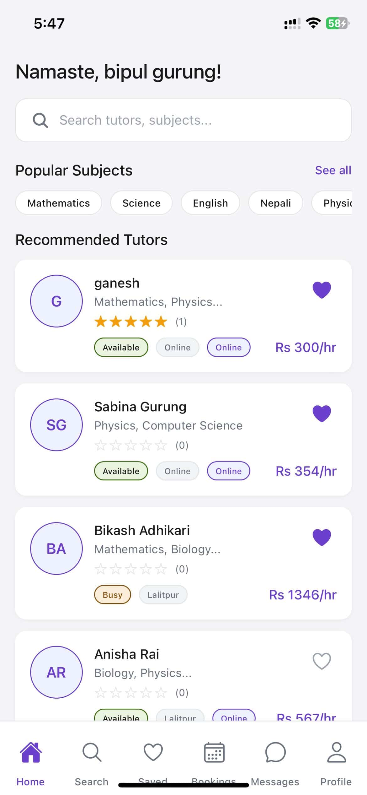
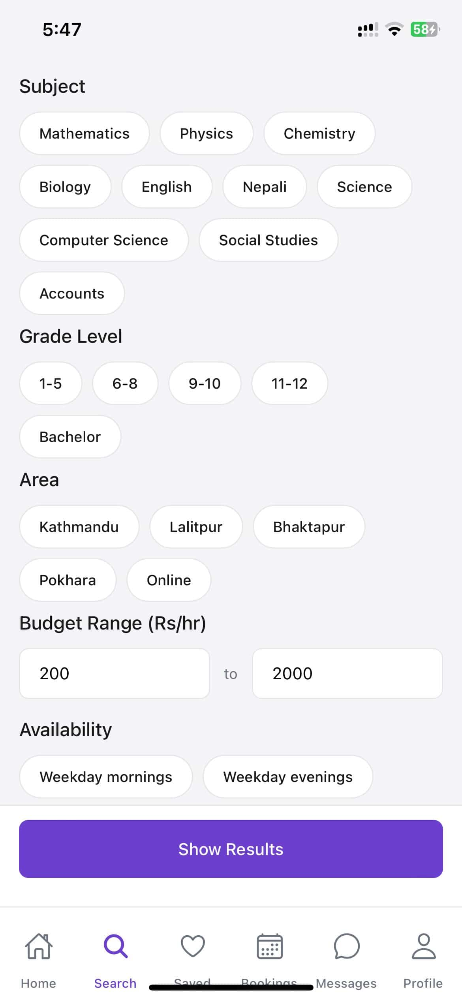
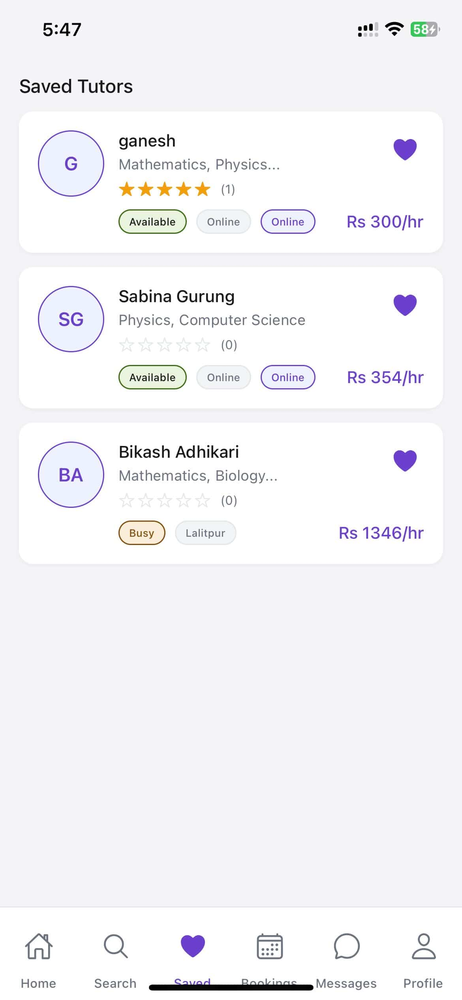
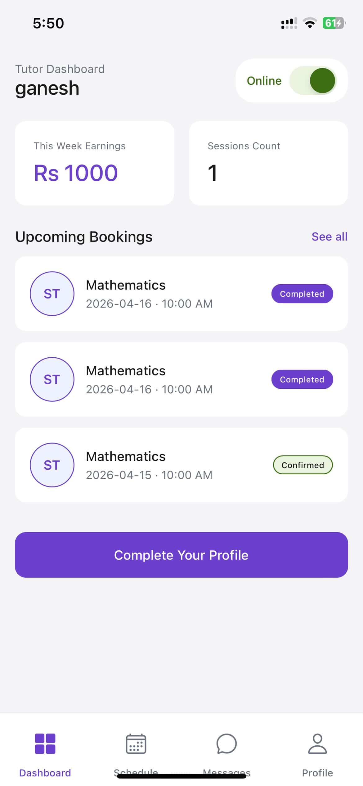
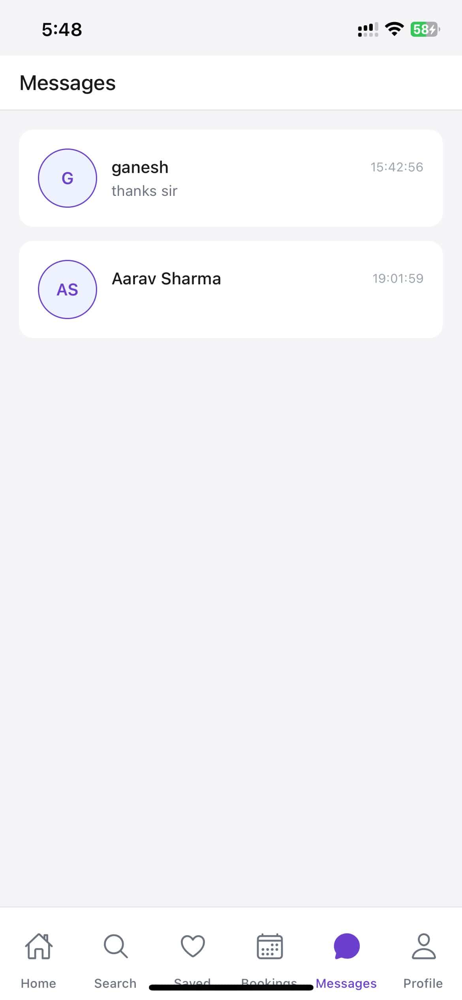

# Tuition Finder

A complete React Native tutor-parent matching platform for Nepal.

## Features

- **Parent Flow**: Find tutors, filter by subject/grade/area/budget, save favorites, book sessions
- **Tutor Flow**: Dashboard with earnings, schedule management, profile setup wizard
- **Shared Features**: Messaging between parents and tutors
- **Locations**: Kathmandu, Lalitpur, Bhaktapur, Pokhara, Online
- **Currency**: Nepali Rupees (NPR)

## Screenshots

### Authentication

| Login | Register |
|:-----:|:--------:|
|  |  |

### Parent Flow

| Home | Search Tutors | Saved Tutors |
|:----:|:-------------:|:------------:|
|  |  |  |

| Tutor Profile | My Bookings | Write Review |
|:-------------:|:-----------:|:------------:|
|  |  |  |

### Tutor Flow

| Tutor Dashboard | Tutor Profile Setup |
|:---------------:|:-------------------:|
|  |  |

### Shared Features

| Messages |
|:--------:|
|  |

## Tech Stack

- React Native with Expo
- React Navigation (Stack + Bottom Tabs)
- NativeWind (Tailwind CSS for React Native)
- AsyncStorage for local state
- Mock JSON data for tutors

## Project Structure

```
src/
├── components/          # Reusable UI components
│   ├── AvatarInitials.js
│   ├── FilterChip.js
│   ├── SectionHeader.js
│   ├── StarRating.js
│   ├── StatusPill.js
│   └── TutorCard.js
├── context/            # State management
│   ├── AuthContext.js
│   ├── BookingContext.js
│   └── TutorContext.js
├── data/               # Mock data
│   └── mockTutors.js
├── navigation/         # Navigation setup
│   ├── AppNavigator.js
│   ├── ParentTabNavigator.js
│   └── TutorTabNavigator.js
└── screens/            # Screen components
    ├── parent/         # Parent flow screens
    ├── tutor/          # Tutor flow screens
    └── shared/         # Shared screens
```

## Getting Started

1. Install dependencies:
```bash
npm install
```

2. Start the development server:
```bash
npm start
```

3. Scan the QR code with the Expo Go app on your phone, or press 'i' for iOS simulator / 'a' for Android emulator.

## Primary Colors

- Primary: `#6C3FCF` (Purple)
- Background: `#F5F5F7`
- Success: `#3B6D11`
- Warning: `#854F0B`

## Nepal-Specific Features

- Areas: Kathmandu, Lalitpur, Bhaktapur, Pokhara
- Currency: NPR (Rs)
- Nepali calendar date notation in bookings
